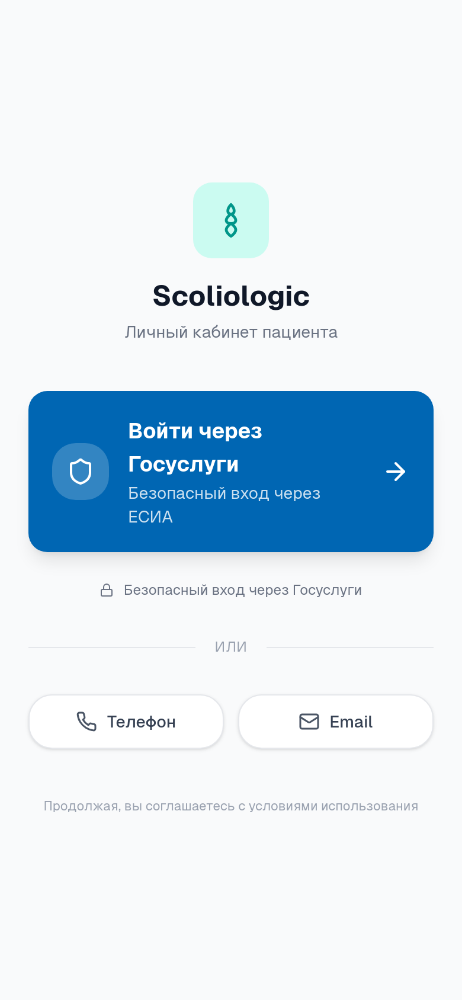
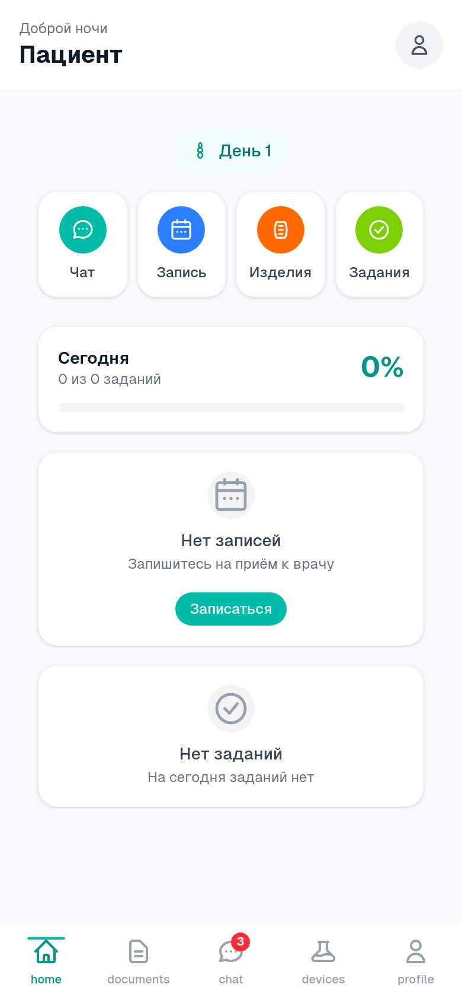
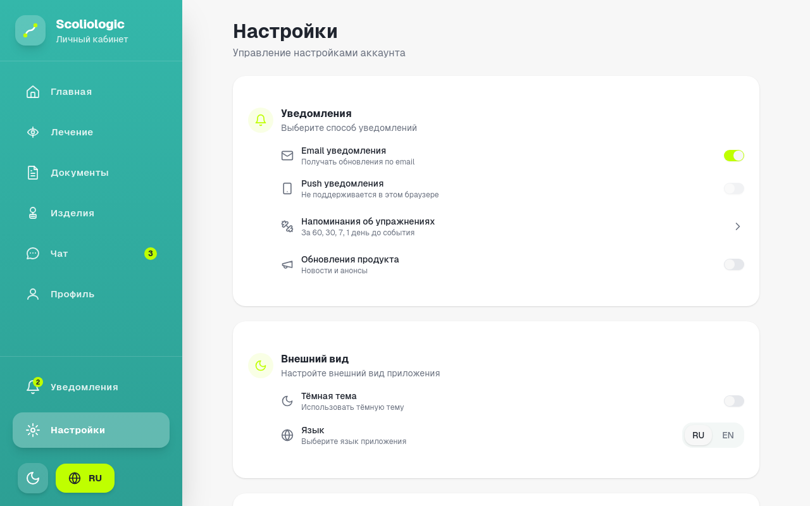
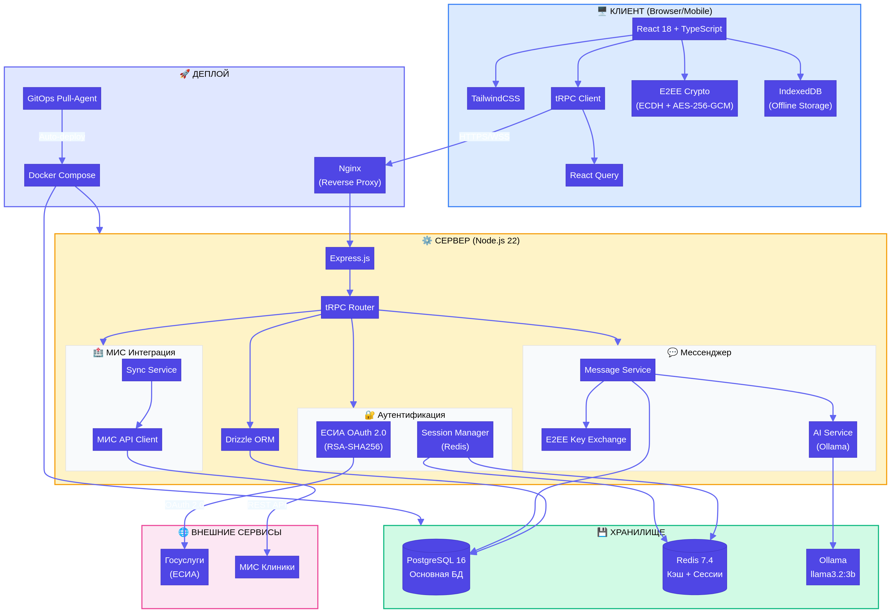
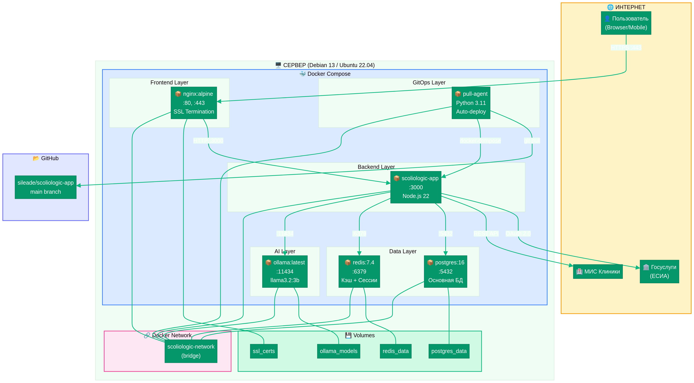
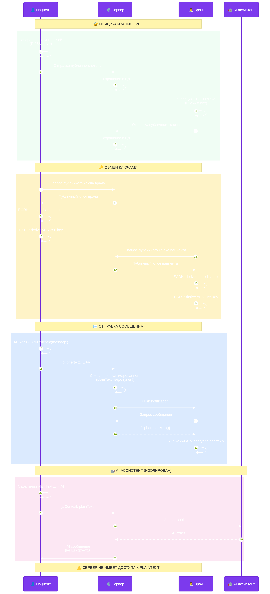
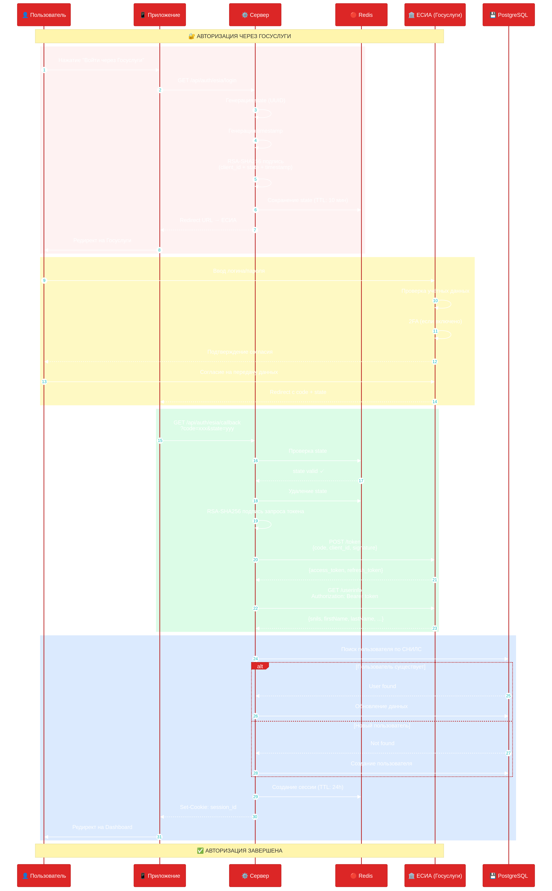
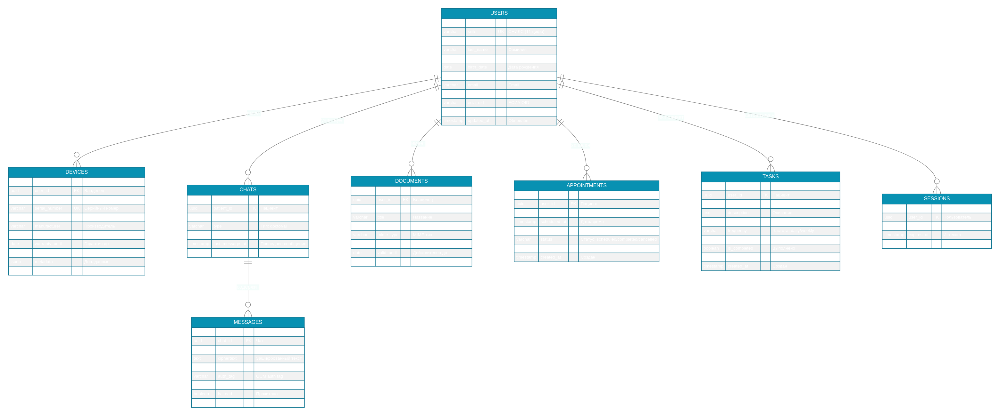

# Scoliologic Patient App

<div align="center">

**Мобильное приложение для пациентов клиники Scoliologic.ru**

[](LICENSE)
[](https://nodejs.org/)
[](https://www.postgresql.org/)
[](https://www.docker.com/)

</div>

---

## 📋 Содержание

- [О проекте](#о-проекте)
- [Возможности](#возможности)
- [Скриншоты](#-скриншоты)
- [Архитектура и диаграммы](#-архитектура-и-диаграммы)
- [Быстрый старт](#-быстрый-старт)
- [Установка](#-установка)
- [Разработка](#-разработка)

---

## 🏥 О проекте

Scoliologic Patient App — это современное веб-приложение для пациентов клиники [Scoliologic.ru](https://scoliologic.ru/), специализирующейся на лечении деформаций позвоночника (сколиоз, кифоз, лордоз).

### Специализация клиники

- **Консервативное лечение** — корсетотерапия по методу Шено
- **Хирургическое лечение** — операции на позвоночнике
- **Реабилитация** — восстановление после операций
- **Детская ортопедия** — лечение сколиоза у детей и подростков

---

## ✨ Возможности

| Функция | Описание | Статус |
|---|---|---|
| **Госуслуги (ЕСИА)** | Авторизация через Единую систему идентификации | ✅ Готово |
| **Интеграция с МИС** | Получение данных о корсетах, ортезах, протезах | ✅ Готово |
| **Защищённый мессенджер** | E2EE чат с врачами (ECDH + AES-256-GCM) | ✅ Готово |
| **AI-ассистент** | Интегрированный в чаты помощник на базе Ollama | ✅ Готово |
| **Документы** | ИПР, справки, договоры, документы СФР | ✅ Готово |
| **GitOps автодеплой** | Pull-агент для автоматического обновления | ✅ Готово |

---

## 🖼️ Скриншоты

| Авторизация | Dashboard | Сообщения | Изделия | Настройки |
|:---:|:---:|:---:|:---:|:---:|
|  |  |  |  |  |

---

## 🏗️ Архитектура и диаграммы

<details>
<summary>Системная архитектура</summary>



</details>

<details>
<summary>Схема развертывания (Deployment)</summary>



</details>

<details>
<summary>Схема E2EE шифрования</summary>



</details>

<details>
<summary>Схема аутентификации (ЕСИА)</summary>



</details>

<details>
<summary>Схема базы данных</summary>



</details>

---

## 🚀 Быстрый старт

### Автоматическая установка (рекомендуется)

```bash
# Одной командой на Debian/Ubuntu
curl -fsSL https://raw.githubusercontent.com/sileade/scoliologic-app/main/install.sh | sudo bash
```

---

## 📦 Установка

### Требования

| Компонент | Минимум | Рекомендуется |
|---|---|---|
| **ОС** | Debian 11+ / Ubuntu 20.04+ | Debian 13 |
| **RAM** | 2 GB | 4 GB |
| **Диск** | 10 GB | 20 GB |
| **CPU** | 2 cores | 4 cores |

### Ручная установка

```bash
# Клонирование репозитория
git clone https://github.com/sileade/scoliologic-app.git
cd scoliologic-app

# Копирование и настройка .env
cp docs/env-template.txt .env
nano .env

# Запуск
docker-compose up -d
```

---

## 🛠️ Разработка

### Запуск в dev-режиме

```bash
# Установка зависимостей
pnpm install

# Запуск
pnpm dev
```

### Тестирование

```bash
# Unit и интеграционные тесты
pnpm test

# Проверка типов
pnpm check

# Линтинг
pnpm lint
```
