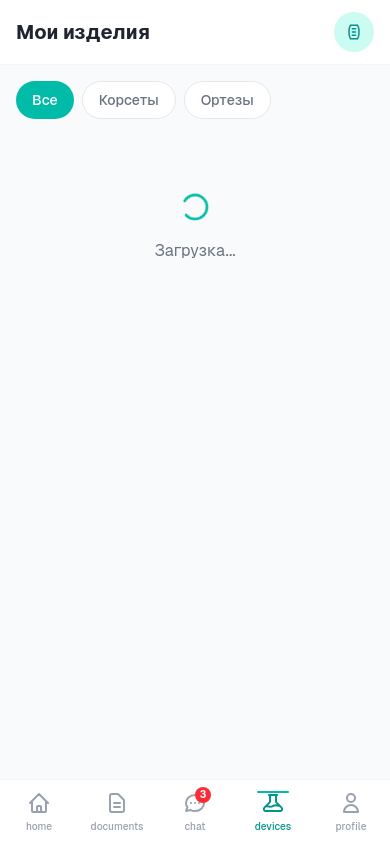

# Scoliologic Patient App

<div align="center">

**Мобильное приложение для пациентов клиники Scoliologic.ru**

[](LICENSE)
[](https://nodejs.org/)
[](https://www.postgresql.org/)
[](https://www.docker.com/)

</div>

---

## 📋 Содержание

- [О проекте](#о-проекте)
- [Возможности](#возможности)
- [Быстрый старт](#-быстрый-старт)
- [Установка](#-установка)
- [Архитектура](#-архитектура)
- [GitOps автодеплой](#-gitops-автодеплой)
- [API документация](#-api-документация)
- [Скриншоты](#-скриншоты)
- [Разработка](#-разработка)

---

## 🏥 О проекте

Scoliologic Patient App — это современное веб-приложение для пациентов клиники [Scoliologic.ru](https://scoliologic.ru/), специализирующейся на лечении деформаций позвоночника (сколиоз, кифоз, лордоз).

### Специализация клиники

- **Консервативное лечение** — корсетотерапия по методу Шено
- **Хирургическое лечение** — операции на позвоночнике
- **Реабилитация** — восстановление после операций
- **Детская ортопедия** — лечение сколиоза у детей и подростков

---

## ✨ Возможности

| Функция | Описание | Статус |
|---------|----------|--------|
| **Госуслуги (ЕСИА)** | Авторизация через Единую систему идентификации | ✅ Готово |
| **Интеграция с МИС** | Получение данных о корсетах, ортезах, протезах | ✅ Готово |
| **Защищённый мессенджер** | E2EE чат с врачами (ECDH + AES-256-GCM) | ✅ Готово |
| **AI-ассистент** | Интегрированный в чаты помощник на базе Ollama | ✅ Готово |
| **Документы** | ИПР, справки, договоры, документы СФР | ✅ Готово |
| **GitOps автодеплой** | Pull-агент для автоматического обновления | ✅ Готово |

### 🤖 AI-ассистент

AI-ассистент **интегрирован во все чаты с врачами**:

```
┌─────────────────────────────────────────────────────────────────┐
│                    ЛОГИКА AI-АССИСТЕНТА                         │
├─────────────────────────────────────────────────────────────────┤
│  1. Пациент отправляет сообщение                               │
│  2. AI мониторит все сообщения в чате                          │
│  3. AI отвечает пока врач недоступен                           │
│  4. Врач отвечает → AI уходит в фон на 1.5 часа               │
│  5. Если врач не отвечает 1.5 часа → AI возвращается          │
└─────────────────────────────────────────────────────────────────┘
```

---

## 🚀 Быстрый старт

### Автоматическая установка (рекомендуется)

```bash
# Одной командой на Debian/Ubuntu
curl -fsSL https://raw.githubusercontent.com/sileade/scoliologic-app/main/install.sh | sudo bash
```

### С дополнительными опциями

```bash
# С Traefik вместо Nginx
sudo ./install.sh --with-traefik

# С мониторингом (Prometheus + Grafana)
sudo ./install.sh --with-monitoring

# С поддержкой GPU для Ollama
sudo ./install.sh --with-gpu

# Все опции
sudo ./install.sh --with-traefik --with-monitoring --with-gpu
```

---

## 📦 Установка

### Требования

| Компонент | Минимум | Рекомендуется |
|-----------|---------|---------------|
| **ОС** | Debian 11+ / Ubuntu 20.04+ | Debian 13 |
| **RAM** | 2 GB | 4 GB |
| **Диск** | 10 GB | 20 GB |
| **CPU** | 2 cores | 4 cores |

### Docker Compose (ручная установка)

```bash
# Клонирование репозитория
git clone https://github.com/sileade/scoliologic-app.git
cd scoliologic-app

# Копирование конфигурации
cp docs/env-template.txt .env
nano .env  # Заполните параметры

# Запуск
docker-compose up -d

# Проверка статуса
docker-compose ps
docker-compose logs -f app
```

### Конфигурация .env

```env
# База данных PostgreSQL
POSTGRES_USER=scoliologic
POSTGRES_PASSWORD=<сгенерированный_пароль>
POSTGRES_DB=scoliologic_db
DATABASE_URL=postgresql://scoliologic:<пароль>@postgres:5432/scoliologic_db

# ЕСИА (Госуслуги) - ОБЯЗАТЕЛЬНО
ESIA_CLIENT_ID=<ваш_client_id>
ESIA_CLIENT_SECRET=<ваш_client_secret>
ESIA_REDIRECT_URI=https://app.scoliologic.ru/api/auth/esia/callback

# МИС интеграция - ОБЯЗАТЕЛЬНО
MIS_API_URL=https://mis.scoliologic.ru/api
MIS_API_KEY=<ваш_api_key>

# GitOps (опционально)
GIT_TOKEN=<github_token>
AUTO_DEPLOY=true
```

---

## 🏗️ Архитектура

### Технологический стек

```
┌─────────────────────────────────────────────────────────────────┐
│                         FRONTEND                                │
├─────────────────────────────────────────────────────────────────┤
│  React 18 + TypeScript + Vite + TailwindCSS + Wouter           │
│  tRPC Client + React Query                                      │
└─────────────────────────────────────────────────────────────────┘
                              │
                              ▼
┌─────────────────────────────────────────────────────────────────┐
│                         BACKEND                                 │
├─────────────────────────────────────────────────────────────────┤
│  Node.js 22 + Express + tRPC + Drizzle ORM                     │
│  ЕСИА OAuth + МИС API + E2EE Messenger                         │
└─────────────────────────────────────────────────────────────────┘
                              │
              ┌───────────────┼───────────────┐
              ▼               ▼               ▼
┌─────────────────┐ ┌─────────────────┐ ┌─────────────────┐
│   PostgreSQL    │ │     Redis       │ │     Ollama      │
│       16        │ │     7.4         │ │   llama3.2:3b   │
└─────────────────┘ └─────────────────┘ └─────────────────┘
```

### Docker Compose сервисы

| Сервис | Порт | Описание |
|--------|------|----------|
| **app** | 3000 | Основное приложение |
| **postgres** | 5432 | База данных |
| **redis** | 6379 | Кэш и сессии |
| **ollama** | 11434 | AI модель |
| **pull-agent** | - | GitOps автодеплой |
| **nginx** | 80, 443 | Reverse proxy |

---

## 🔄 GitOps автодеплой

### Pull-агент

Автоматическое обновление приложения при новых коммитах:

```
┌─────────────────────────────────────────────────────────────────┐
│                      PULL-AGENT WORKFLOW                        │
├─────────────────────────────────────────────────────────────────┤
│  1. Проверка репозитория каждые 5 минут                        │
│  2. Обнаружен новый коммит?                                    │
│  3. git pull origin main                                       │
│  4. docker-compose build app                                   │
│  5. Health check старого контейнера                            │
│  6. docker-compose up -d app (rolling update)                  │
│  7. Health check нового контейнера                             │
│  8. При ошибке → автоматический rollback                       │
│  9. Уведомление в Telegram/Slack                               │
└─────────────────────────────────────────────────────────────────┘
```

### Конфигурация Pull-агента

```env
# GitOps настройки
GIT_REPO_URL=https://github.com/sileade/scoliologic-app.git
GIT_BRANCH=main
GIT_TOKEN=ghp_xxxxxxxxxxxx  # GitHub Personal Access Token
CHECK_INTERVAL=300          # Интервал проверки (секунды)
AUTO_DEPLOY=true            # Автоматический деплой
ROLLBACK_ON_FAILURE=true    # Откат при ошибке

# Уведомления
TELEGRAM_BOT_TOKEN=<bot_token>
TELEGRAM_CHAT_ID=<chat_id>
SLACK_WEBHOOK_URL=<webhook_url>
```

### Ручное управление

```bash
# Принудительное обновление
docker exec scoliologic-pull-agent python -c "from pull_agent import PullAgent; PullAgent().check_and_deploy()"

# Просмотр логов
docker-compose logs -f pull-agent

# Откат к предыдущей версии
docker exec scoliologic-pull-agent python -c "from pull_agent import PullAgent; PullAgent().rollback()"
```

---

## 📡 API документация

### Health Check Endpoints

```bash
# Полный статус
GET /api/health
{
  "status": "healthy",
  "timestamp": "2026-01-16T01:00:00.000Z",
  "version": "1.0.0",
  "uptime": 3600,
  "checks": {
    "database": { "status": "up", "latency": 5 },
    "redis": { "status": "up", "latency": 2 },
    "ollama": { "status": "up", "latency": 50 }
  }
}

# Liveness probe (для Kubernetes)
GET /api/health/live
{ "status": "alive" }

# Readiness probe
GET /api/health/ready
{ "status": "ready" }

# Prometheus метрики
GET /api/metrics
```

### tRPC Endpoints

```typescript
// ЕСИА
GET  /api/auth/esia/login      // Начало авторизации
GET  /api/auth/esia/callback   // Callback от Госуслуг

// МИС
trpc.mis.getPatient()          // Данные пациента
trpc.mis.getDevices()          // Список изделий
trpc.mis.sync()                // Синхронизация с МИС

// Мессенджер
trpc.messenger.getChats()      // Список чатов
trpc.messenger.sendMessage()   // Отправка сообщения
trpc.messenger.exchangeKeys()  // Обмен ключами E2EE

// AI
trpc.ai.chat()                 // Запрос к AI
trpc.ai.health()               // Статус Ollama
```

---

## 📱 Mobile-First Design

Приложение **оптимизировано для мобильных устройств** с поддержкой жестов:

### Мобильные скриншоты

| Dashboard | Мессенджер | Документы |
|:---------:|:----------:|:---------:|
|  |  |  |

| Изделия | Авторизация |
|:-------:|:-----------:|
|  |  |

### Управление жестами

| Жест | Действие | Где работает |
|------|----------|--------------|
| **Свайп вниз** | Pull-to-refresh (обновление данных) | Все списки |
| **Свайп влево** | Удалить / Архивировать | Документы, Чаты |
| **Свайп вправо** | Скачать / Отметить прочитанным | Документы, Чаты |
| **Long press** | Контекстное меню | Карточки, Сообщения |
| **Pinch** | Масштабирование | Документы, Изображения |
| **Double tap** | Быстрое действие | Сообщения (лайк) |

### Touch-оптимизация

- **Минимальный размер кнопок:** 48x48px (Apple HIG)
- **Отступы между элементами:** 12px минимум
- **Haptic feedback:** Вибрация при свайпах
- **Safe areas:** Поддержка notch и home indicator
- **Overscroll:** Резиновый эффект при прокрутке

---

## 🖼️ Desktop скриншоты

| Dashboard | Мессенджер | Документы |
|:---------:|:----------:|:---------:|
|  |  |  |

| Изделия | Авторизация |
|:-------:|:-----------:|
|  |  |

---

## 🎨 Дизайн-система

### Цветовая палитра

| Цвет | HEX | Использование |
|------|-----|---------------|
| **Lime** | `#BFFF00` | Кнопки, акценты, прогресс-бары |
| **Teal** | `#2DBDB6` | Навигация, иконки, AI-ассистент |
| **Teal Dark** | `#1A9A94` | Градиенты, hover-состояния |
| **Dark** | `#1A1A2E` | Фон, текст |
| **Light** | `#F8F9FA` | Карточки, фон |

---

## 🛠️ Разработка

### Локальный запуск

```bash
# Установка зависимостей
pnpm install

# Запуск в режиме разработки
pnpm dev

# Проверка типов
pnpm check

# Запуск тестов
pnpm test

# Сборка для production
pnpm build
```

### Структура проекта

```
scoliologic-app/
├── client/                 # Frontend (React)
│   ├── src/
│   │   ├── components/     # UI компоненты
│   │   ├── contexts/       # React контексты
│   │   ├── lib/            # Утилиты (tRPC, crypto)
│   │   └── pages/          # Страницы приложения
├── server/                 # Backend (Node.js)
│   ├── _core/              # Ядро (auth, OAuth)
│   ├── ai/                 # Ollama интеграция
│   ├── esia/               # Госуслуги (ЕСИА)
│   ├── messenger/          # E2EE мессенджер
│   ├── mis/                # МИС интеграция
│   └── health.ts           # Health check API
├── drizzle/                # Схема БД
├── deploy/                 # Docker, GitOps
│   ├── pull-agent/         # Pull-агент
│   ├── nginx/              # Nginx конфиг
│   └── prometheus/         # Мониторинг
├── docker-compose.yml      # Docker Compose
└── install.sh              # Автоустановщик
```

### Тестирование

```bash
pnpm test

# Результат:
# Test Files  4 passed (4)
# Tests       37 passed (37)
```

---

## 📄 История изменений

### v1.4.0 (2026-01-16)
- **Docker Compose** — полный стек с PostgreSQL, Redis, Ollama
- **GitOps Pull-агент** — автоматическое обновление из Git
- **Health Check API** — /api/health, /api/health/live, /api/health/ready
- **Prometheus метрики** — /api/metrics
- **Автоустановщик** — install.sh для Debian/Ubuntu

### v1.3.0 (2026-01-16)
- AI-ассистент интегрирован в чаты
- Таймер возврата AI (1.5 часа)
- Ручное управление AI

### v1.2.0 (2026-01-16)
- Миграция с MySQL на PostgreSQL 16

### v1.1.0 (2026-01-16)
- Интеграция с Госуслугами (ЕСИА)
- Интеграция с МИС
- Защищённый мессенджер E2EE

### v1.0.0 (2026-01-16)
- Первый релиз

---

## 📄 Лицензия

MIT License — см. [LICENSE](LICENSE)

---

## 🤝 Поддержка

- **Email:** support@scoliologic.ru
- **Telegram:** [@scoliologic_support](https://t.me/scoliologic_support)
- **Issues:** [GitHub Issues](https://github.com/sileade/scoliologic-app/issues)

---

<div align="center">

**Разработано для [Scoliologic.ru](https://scoliologic.ru/)**

*Здоровый позвоночник — здоровая жизнь*

</div>
